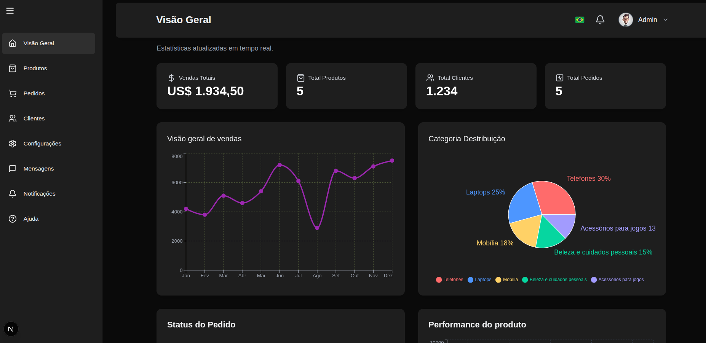
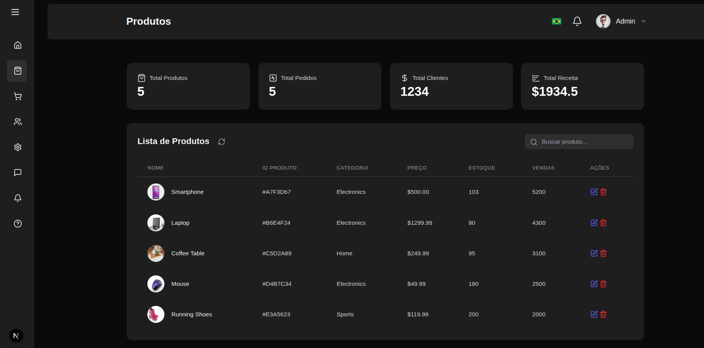

## AdminHub — Dashboard de Controle Interno

Projeto de dashboard administrativo construído com Next.js (App Router), Supabase e Tailwind, com autenticação e proteção de rotas, carregamento global e gráficos reativos.

Este README documenta o fluxo de autenticação e navegação, as tecnologias usadas, a arquitetura de pastas, e inclui espaços para adicionar prints das telas (login, visão geral, produtos, clientes, sidebar aberta/fechada).


### Visão Geral (Dashboard)


## Stack e principais libs

- Next.js 15.3.3 (App Router)
	- Dev: Turbopack (`next dev --turbopack`)
	- Middleware para proteger rotas
- React 19
- Tailwind CSS v4
- Supabase
	- `@supabase/ssr` para integração no servidor/middleware
	- `@supabase/supabase-js` para o cliente
- Recharts (gráficos)
- Framer Motion (animações)
- lucide-react (ícones)

## Arquitetura (visão geral)

- `app/`
	- `layout.jsx`: aplica providers globais e layout condicional
	- `page.jsx`: checa sessão no servidor e faz redirect para `/login` ou `/dashboard`
	- `login/page.jsx`: página de login (CSR)
	- `dashboard/page.jsx`, `products/page.jsx`, `orders/page.jsx`, `users/page.jsx`, `clients/page.jsx`, etc.
- `components/`
	- `layout/Sidebar.jsx`, `layout/Header.jsx`, `layout/PageTransition.jsx`
	- `auth/AuthGuard.jsx` (proteção de rotas no client)
	- `providers/LoadingProvider.jsx` (loading global e utilitários)
	- `dashboard/DynamicDashboard.jsx` (cards de estatísticas)
	- `features/analytics/*` (gráficos com Recharts)
	- `tables/*` (tabelas de produtos, pedidos, clientes)
- `lib/supabase-queries.ts`: camadas de dados (CRUD e métricas) que usam o cliente do browser
- `utils/supabase/`
	- `client.ts`: `createBrowserSupabase()`
	- `server.ts`: `createServerSupabase()` (uso exclusivamente em Server Components ou `app/page.jsx`)
- `middleware.ts`: checa sessão via Supabase e redireciona para login/dash nas rotas privadas
- `public/data/data.json`: dados de exemplo para gráficos

## Fluxo de autenticação e navegação

1) Acesso inicial (server)
- Em `app/page.jsx`, um Server Component cria um cliente Supabase para servidor (`createServerSupabase`) e verifica o usuário.
- Sem sessão: redirect para `/login`. Com sessão: redirect para `/dashboard`.

2) Proteção de rotas (Edge/Middleware)
- `middleware.ts` roda em rotas privadas (dashboard, products, orders, clients, users, sales, configuracoes, help, mensagens, notificacoes).
- Sem usuário nessas rotas: redireciona para `/login`.
- Usuário tentando acessar `/login`: redireciona para `/dashboard`.

3) Proteção adicional no cliente (AuthGuard)
- `components/auth/AuthGuard.jsx` envolve todo o app em `app/layout.jsx` e:
	- Executa `supabase.auth.getSession()` no cliente para estado inicial.
	- Escuta `onAuthStateChange` para reagir a login/logout.
	- Roteia automaticamente: SIGNED_IN em rota pública -> `/dashboard`; SIGNED_OUT -> `/login`.

4) Layout condicional
- `components/ConditionalLayout.jsx` esconde `Header` e `Sidebar` em páginas públicas (`/login`, etc.) e aplica o layout padrão do dashboard nas privadas.

5) Sidebar e título dinâmicos
- `components/layout/Sidebar.jsx` usa `usePathname()` para marcar ativo com `pathname.startsWith(item.href)` (funciona com rotas aninhadas).
- `components/layout/Header.jsx` deriva o título da rota atual (mapeamento + fallback capitalizado).

## Dados e gráficos

- Métricas do dashboard e CRUD: `lib/supabase-queries.ts`
	- Busca em tabelas `products`, `orders`, `users` (quando disponíveis), com fallbacks de dados estáticos e delays simulados.
	- Ex.: `getDashboardData` calcula totais a partir de produtos/pedidos; `getProducts`, `getOrders`, etc.
- Gráficos (Recharts): `components/features/analytics/*`
	- Consomem `public/data/data.json` como base de demonstração.
	- Animações com Framer Motion.

## Variáveis de ambiente

Crie `.env` na raiz com:

```
NEXT_PUBLIC_SUPABASE_URL=...
NEXT_PUBLIC_SUPABASE_ANON_KEY=...
```

Observações:
- As chaves são usadas tanto no cliente (`createBrowserSupabase`) quanto no servidor/middleware (`createServerClient`).
- Caso deseje evitar avisos do Edge Runtime sobre APIs de Node na build, você pode migrar o middleware para `@supabase/auth-helpers-nextjs` (opcional). No estado atual, os avisos não impedem o build.

## Como rodar

1) Instalar dependências
```bash
npm install
```

2) Rodar em desenvolvimento (Turbopack)
```bash
npm run dev
```

3) Build de produção
```bash
npm run build
npm start
```

## Banco de dados (Supabase)

- Há um script de referência: `supabase-setup.sql` (você pode adaptar às suas tabelas reais).
- Tabelas esperadas pelo app (exemplos):
	- `products` (id, name, category, price, stock, sales, image)
	- `orders` (id, client, email, total, status, date, country)
	- `users` (opcional para clientes, senão usa fallback estático)

## Estrutura de pastas (resumo)

```
app/
	layout.jsx          # Providers e layout condicional
	page.jsx            # Redirect inicial server-side
	login/page.jsx      # Página pública
	dashboard/page.jsx  # Página principal (client)
	products/page.jsx   # Produtos (client)
	users/page.jsx      # Clientes/Users (client)
	orders/page.jsx     # Pedidos (client)
components/
	layout/{Header,Sidebar,PageTransition}.jsx
	auth/{AuthGuard,SignOutButton}.jsx
	providers/LoadingProvider.jsx
	dashboard/DynamicDashboard.jsx
	features/analytics/* (Recharts)
	tables/* (Tabelas UI)
lib/
	supabase-queries.ts # Acesso a dados (CSR)
utils/supabase/
	client.ts           # createBrowserSupabase
	server.ts           # createServerSupabase (server-only)
middleware.ts         # Proteção de rotas
public/data/data.json # Base para gráficos
```

## Prints das telas (adicione aqui)

Criei a pasta `docs/screenshots/`. Exporte suas imagens para lá e atualize os paths abaixo.

### Login


### Visão Geral (Dashboard)


### Produtos


### Clientes


### Sidebar 


### Sidebar 


## Decisões de projeto e boas práticas

- Separação clara entre server e client: `createServerSupabase` é usado apenas em Server Components (ex.: `app/page.jsx`). Nas páginas/clientes, usamos `createBrowserSupabase`.
- Proteção redundante (middleware + guard): garante UX fluida e segurança, com redirecionamento imediato em mudanças de sessão.
- Loading global controlado por contexto: `LoadingProvider` oferece `withDbLoading` e `withPageLoading` para UX consistente.
- Sidebar e Header dinâmicos: feedback visual correto da rota e título coerente com a página atual.
- Fallbacks de dados: app continua funcional sem banco configurado (útil para desenvolvimento/demo).

## Roadmap sugerido

- Migrar queries críticas para server actions quando necessário (Next.js App Router) para segurança/latência controlada.
- Consolidar definição de rotas/títulos em módulo único compartilhado por Sidebar e Header.
- Adicionar testes de integração e2e (Playwright) para fluxo de login e navegação.
- Adicionar modo i18n (pt-BR/en-US) com `next-intl`.

---

Qualquer dúvida ou se quiser que eu integre automaticamente seus prints no README, envie os arquivos e eu atualizo as referências.
